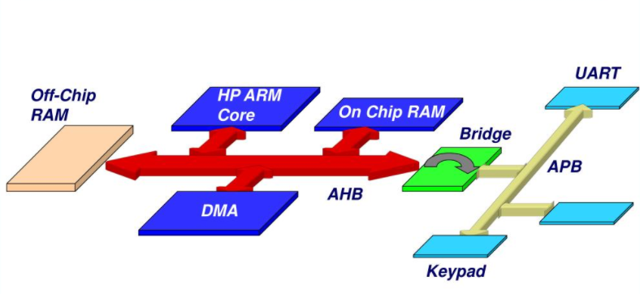
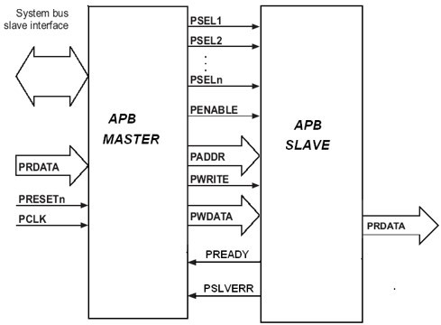
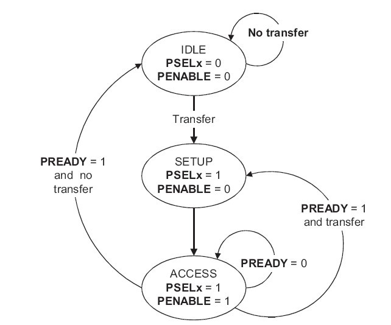
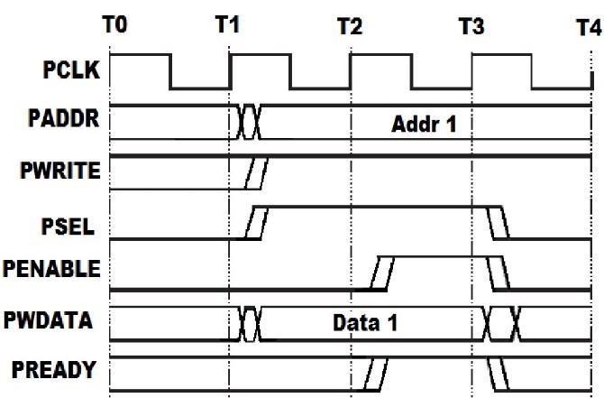
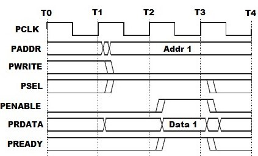
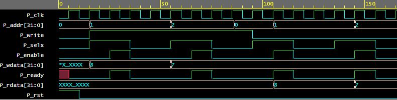

# AMBA-APB-PROTOCOL
###        Raj Kumar Laldev 
 Advance VLSI Lab   
   Silicon institute of technology Bhubaneswar,India  
       rajbihar5364@gmail.com
 # Table of Contents 
- [Introduction of AMBA](#Introduction-of-AMBA)  
- [AMBA Bus architecture](#AMBA-Bus-Architechture)   
  * [Types of AMBA Bus](#Types-of-AMBA-Bus)
  * [AHB VS APB](#AHB-VS-APB)
- [Advanced Peripheral Bus](#Advanced-Peripheral-Bus)
  * [APB Block Diagram](#APB-Block-Diagram)
  * [Signal specification of APB](#signal-specification-of-APB)
- [Design and operating states of APB](#Design-and-operating-states-of-APB)
  * [Write operation](#Write-operation)
  * [Read operation](#Read-operation)
-  [Simulation results of APB design](#Simulation-results-of-APB-design)
-  [Conclusion](#Conclusion)
- [Acknowledgement](#Acknowledgement)
- [References](#References)

# Introduction of AMBA
- Advanced microcontroller bus architecture (AMBA) is an architecture that is widely used in system-on-chip designs, which are found on chip buses. 
- The AMBA specification standard is used for designing high-level embedded microcontrollers. 
- AMBA’s major objective is to provide technology independence and to encourage modular system design. Furthermore, it strongly encourages the development of reusable peripheral devices while minimizing silicon infrastructure.
-  Today, AMBA is widely used on a range of ASIC and SoC parts including applications processors used in modern portable mobile devices like smartphones.

  AMBA was introduced by ARM in 1996. The first AMBA buses were the Advanced System Bus (ASB) and the Advanced Peripheral Bus (APB).     
  In its second version, AMBA 2 in 1999, ARM added AMBA High-performance Bus (AHB) that is a single clock-edge protocol.    
  In 2003, ARM introduced the third generation, AMBA 3, including Advanced eXtensible Interface (AXI) to reach even higher performance interconnect and the Advanced Trace Bus (ATB) as part of the CoreSight on-chip debug and trace solution.                       
  In 2010, the AMBA 4 specifications were introduced starting with AMBA 4 AXI4, then      
  in 2011,  extending system-wide coherency with AMBA 4 AXI Coherency Extensions (ACE).    
  In 2013, the AMBA 5 Coherent Hub Interface (CHI) specification was introduced, with a re-designed high-speed transport layer and features designed to reduce congestion.

  # AMBA Bus architecture
  - AMBA is an open specification that specifies a strategy on the management of the functional blocks that     sort system on chip (SoC) architecture. 
  - It is a high-speed, high-bandwidth bus that supports multimaster bus management to get the most out of    system performance.
  - AMBA specifications are able to maximize the use of system bus bandwidth during dead time. After        defining a common backbone for SoC modules, it enhances a reusable design methodology. 
  - This system has emerged as the defacto standard for IP library progress and SoC interconnection.

    

  - This is development of embedded microcontroller products with one or more CPUs or signal processors. 
  -  This is highly reusable peripheral appropriate for full-custom, standard cell and gate array technologies. 
  -  It provides a road-map for advanced cached CPU cores and the development of peripheral libraries to minimize the silicon infrastructure required to support efficient on-chip.   
  An AMBA is having backbone bus AMBA AHB or AMBA ASB. It sustains external memory bandwidth, on which the CPU, on-chip memory and other Direct Memory Access (DMA) devices abide. This bus provides a high-bandwidth interface between the elements that are involved in the majority of transfers. Also it is a bridge to the lower bandwidth APB.

 ## Types of AMBA Bus

 Five interfaces are defined within the AMBA specification: 
-   Advanced system bus (ASB)
-   Advanced peripheral bus (APB)
-   Advanced high-performance bus (AHB)
-   Advanced extensible interface (AXI)
-   Advanced trace bus (ATB)

## AHB VS APB
- AHB stands for Advanced High-performance Bus and APB sands for Advanced Peripheral Bus. Both the Advanced High-performance Bus and the Advanced Peripheral Bus are part of the Advanced Microprocessor Bus Architecture (AMBA). Though both the AHB and the APB belong to AMBA, they differ in many way.    
- Difference between the two, the AHB uses a full duplex parallel communication whereas the APB uses massive memory-I/O accesses. Both the AHB and the APB are on chip Bus standards. The Advanced High-performance Bus is capable of waits, errors and bursts. The ADH, which is pipelined, mainly connects to memories.      
- When comparing the usage, the APB is simpler than the AHB. Unlike the AHB, there is no pipelining in APB. The APB is mainly proposed for connecting to simple peripherals. Looking at the AHB and the APB, it can be seen that the APB comes with a low power peripheral.         
- It can also be seen that Advanced Peripheral Bus is sometimes optimized for reduced interface complexity and minimal power consumption for supporting peripheral functions. This Bus can also be used in union with either version of the system bus.               
- When looking at the features of AHB, it has a single edge clock protocol, several bus masters, split transactions, single-cycle bus master handover, burst transfers, large bus widths.          
- In AHB, the transaction consists of an address phase and a data phase. In case of AHB, there is only one Bus master at a time. When compared to Advanced High-performance Bus, the Advanced Peripheral Bus is only used for low bandwidth control accesses. Though the APB has an address phase and data phase as like that of the AHB, it comes with a list of low complexity signal.

# Advanced Peripheral Bus
- The Advanced Peripheral Bus (APB) is part of the Advanced Micro  controller Bus Architecture (AMBA)  .
-  APB is optimized for minimal power consumption and reduced  interface  complexity.
- The AMBA APB should be used to interface to any peripherals which are  low bandwidth and do not require the  high performance of a pipelined bus  interface.
- The AMBA APB appears as a local secondary bus that is encapsulated as  a single AHB or ASB slave  device.
- AMBA APB provides the basic peripheral macro cell communications infrastructure as a secondary bus from the  higher bandwidth pipelined main system bus. It consist of interfaces which are memory-mapped registers.

## APB block diagram

  

## Signal specification of APB
 **PCLK Clock:** The rising edge of PCLK times all transfers on the APB.   
 **PRESET:** System bus equivalent Reset. The APB reset signal is active LOW.  
 **PADDR:**  32 bit address bus PSEL The slave device is selected and that a data transfer is required.   
 **PENABLE Enable:** This signal indicates the second and subsequent cycles of an APB transfer.   
 **PWRITE:**  Access when HIGH.    
 **PWDATA:**  32 bits Write data PWRITE is HIGH.     
 **PREADY:**  Ready To extend an APB transfer.    
 **PRDATA:**  32 bits Read data and PWRITE is LOW.   
 **PSLAVERR Slave error:** This signal indicates a transfer failure. 

  # Design and operating states of APB

   

**IDLE :** This is the default state of the APB.                
**SETUP:**  When a transfer is required the bus moves into the SETUP state, where the appropriate select signal, **PSELx**, is asserted. The bus only remains in the SETUP state for one clock cycle and always moves to the ACCESS state on the next rising edge of the clock.                       
**ACCESS:** The enable signal, **PENABLE**, is asserted in the ACCESS state. The address, write, select, and write data signals must remain stable during the transition from the SETUP to ACCESS state.
Exit from the ACCESS state is controlled by the **PREADY** signal from the slave: 
- If PREADY is held LOW by the slave then the peripheral bus remains in the ACCESS state.             
-  If PREADY is driven HIGH by the slave then the ACCESS state is exited and the bus returns to the IDLE state if no more transfers are required. Alternatively, the bus moves directly to the SETUP state if another transfer follows.

# Write operation

  

- At T1, a write transfer starts with PADDR, PWDATA, PWRITE, and PSEL, being registered at the rising edge of PCLK. It is called the SETUP cycle.                                    
-  At the next rising edge of the clock T2 it is called ACCESS cycle, PENABLE, and PREADY, are registered. When asserted, PENABLE indicates starting of Access phase of the transfer. When asserted, PREADY indicates that the slave can complete the transfer at the next rising edge of PCLK.                     
- The PADDR, PWDATA, and control signals all remain valid until the transfer completes at T3, the end of the Access phase.                                                         
- The PENABLE, is disabled at the end of the transfer. The select signal PSEL is also disabled unless the transfer is to be followed immediately by another transfer to the same peripheral.                       

# Read operation
 
  

- During read operation the PENABLE, PSEL, PADDR PWRITE, signals are asserted at the clock edge T1 (**SETUP cycle**).         
- At the clock edge T2, (**ACCESS cycle**), the PENABLE, PREADY are asserted and PRDATA is also read during this phase. The slave must provide the data before the end of the read transfer.  

# Simulation results of APB design
                
 Verilog implementation of Operating states of APB. please [click here](https://www.edaplayground.com/x/2gvY) 

  # Conclusion
- This paper gives an outline of the AMBA bus architecture and explain the APB bus in detail. The APB bus is designed using the Verilog HDL according to the specification and is verified using **EDAplaground**.        
- The simulation results show that the data read from a particular memory location is same as the data written to the given memory location.               
- The results obtained after the simulation will be compared with the results.

# Acknowledgement

I would like to thank our Institution for equipping us with Advanced VLSI Lab facilities to successfully execute our project. I am also grateful to our mentor, [Dr. Saroj Rout](https://www.linkedin.com/in/sroutk?lipi=urn%3Ali%3Apage%3Ad_flagship3_profile_view_base_contact_details%3BGPdq1QbhS6mnLJPpjzlEIQ%3D%3D) and  [Prof: Santunu sarangi](https://www.linkedin.com/in/santunu-sarangi-b731305b?lipi=urn%3Ali%3Apage%3Ad_flagship3_profile_view_base_contact_details%3Bg9BX%2F0YtQ0yyTenaLLJTog%3D%3D) for their constant advice and guidance throughout the project duration.

# References
        
[1] ARM, “AMBA Specification Overview”, available at [URL](http://www.arm.com/)       
[2] ARM, “AMBA Specification (Rev 2.0)”, available at [URL](http://www.arm.com)                
[3] URL: [click here](http://www.differencebetween.net/technology/difference-between-ahb-and-apb)        
[4] Samir Palnitkar, “Verilog HDL: A guide to Digital Design and Synthesis (2nd Edition), Pearson, 2008.       
[5] URL:[click here](http://www.testbench.com)     
